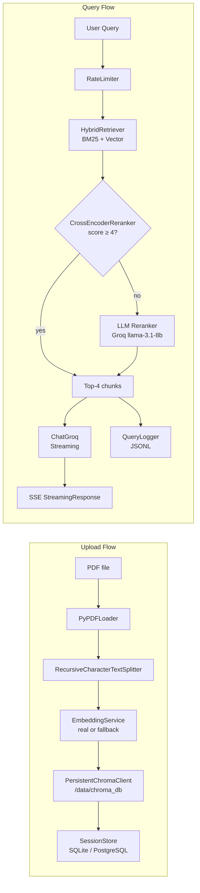

# Design Document: RAG Production Hardening

## Overview

DocMind AI currently runs with fully ephemeral state: vector embeddings and session data live only in process memory and vanish on every Cloud Run scale-to-zero event. This design covers eight hardening areas that transform DocMind AI into a production-grade service:

1. **Persistent Vector Store** — swap ChromaDB's `EphemeralClient` for a `PersistentClient` backed by a durable Cloud Run volume.
2. **Persistent Session and Chat History** — store sessions in SQLite (dev) / PostgreSQL (prod) so cold starts don't erase context.
3. **Embedding Fallback Visibility** — surface `fallback_embedding` flags in API responses and show warning banners in the React UI.
4. **Cross-Encoder Reranking with LLM Escalation** — replace always-on LLM reranking with a local `cross-encoder/ms-marco-MiniLM-L-6-v2` as default, escalating to Groq only when confidence is low.
5. **Automated Test Suite** — pytest unit tests and a RAGAS regression test covering chunking, retrieval, reranking, and citation mapping.
6. **Query Observability Logging** — append-only JSONL query log with a secured admin endpoint.
7. **Rate Limiting** — per-IP sliding-window middleware on `/upload` and `/chat`.
8. **Documentation** — architecture diagram and roadmap in README.

The backend stays FastAPI / Python 3.11 on Cloud Run. No new external services are added beyond a persistent disk volume and an optional PostgreSQL instance.


## Architecture

### Current Architecture (Ephemeral)

```
Browser (React/Vite)
  │  POST /upload  ──►  FastAPI (Cloud Run)
  │                        └─ EphemeralChromaClient  ← LOST on restart
  │  POST /chat/stream ──►  in-memory sessions dict  ← LOST on restart
  │                        └─ BM25 + Vector Hybrid
  │                        └─ LLM Reranker (Groq, every query)
  │                        └─ ChatGroq (llama-3.1-8b-instant)
```

### Target Architecture (Production-Hardened)

```
Browser (React/Vite)
  │  POST /upload  ──►  FastAPI (Cloud Run)
  │                        ├─ RateLimiter (per-IP sliding window)
  │                        ├─ EmbeddingService (real / fallback)
  │                        ├─ PersistentChromaClient  → Cloud Run Volume (/data/chroma_db)
  │                        └─ SessionStore (SQLite/PostgreSQL)  → /data/sessions.db
  │
  │  POST /chat/stream ──►  FastAPI (Cloud Run)
  │                        ├─ RateLimiter
  │                        ├─ SessionStore.load()
  │                        ├─ BM25 + Vector Hybrid Retriever
  │                        ├─ CrossEncoderReranker (local, default)
  │                        │    └─ escalate to LLM Reranker (Groq) if score < 4
  │                        ├─ ChatGroq (streaming)
  │                        └─ QueryLogger  → /data/query_log.jsonl
  │
  │  GET /admin/query-logs ──►  QueryLogger.tail(50)  [ADMIN_API_KEY required]
```

### Mermaid Pipeline Diagram




## Components and Interfaces

### 1. PersistentVectorStore (`rag_core.py`)

**Change:** Replace `chromadb.EphemeralClient()` with `chromadb.PersistentClient(path=CHROMA_DIR)` where `CHROMA_DIR` defaults to `/data/chroma_db` (overridable via `CHROMA_PERSIST_DIR` env var).

```python
# Current
chroma_client = _chromadb.EphemeralClient()

# New
CHROMA_DIR = os.getenv("CHROMA_PERSIST_DIR", "/data/chroma_db")
chroma_client = _chromadb.PersistentClient(path=CHROMA_DIR)
```

**Startup guard:** A new `check_storage_health()` function runs at import time. If `PersistentClient` raises, it sets a module-level `STORAGE_UNAVAILABLE` flag. All `/upload` and `/chat` handlers check this flag and return HTTP 503 with the error message.

**`build_vectorstore` signature change:** Accepts a `session_id` parameter to namespace collection names (`f"pdf_{session_id}"`) so multiple users' data coexists on disk without collision.

```python
def build_vectorstore(chunks, session_id: str, collection_name: str = None) -> SimpleVectorStore
```

**Fallback flag:** `build_vectorstore` returns a named tuple / dict that includes `is_fallback: bool` alongside the store object, so `main.py` can propagate it in the response.

---

### 2. SessionStore (`backend/session_store.py` — new file)

A thin persistence layer wrapping SQLAlchemy. Uses SQLite for local dev and PostgreSQL in prod based on `DATABASE_URL` env var.

```python
class SessionStore:
    def __init__(self, db_url: str): ...
    def save(self, session_id: str, record: dict) -> None: ...
    def load(self, session_id: str) -> dict | None: ...
    def load_all(self) -> list[dict]: ...
    def purge_old(self, days: int = 30) -> int: ...  # returns count deleted
```

**Schema (SQLite/PostgreSQL):**

| Column | Type | Notes |
|---|---|---|
| `session_id` | TEXT PK | Browser UUID |
| `pdf_names` | TEXT | JSON array |
| `num_pages` | INTEGER | |
| `num_chunks` | INTEGER | |
| `chat_history` | TEXT | JSON array |
| `collection_name` | TEXT | ChromaDB collection name |
| `is_fallback` | BOOLEAN | Whether fallback embeddings were used |
| `created_at` | DATETIME | |
| `updated_at` | DATETIME | |

**New `main.py` routes:**
- `DELETE /admin/sessions/purge` — calls `store.purge_old(30)`, returns `{"deleted": N}`. Also triggered daily by an APScheduler background job.
- `GET /session/{session_id}` — unchanged interface, now reads from DB instead of in-memory dict.

**Error handling:** If the DB is unreachable, `save()` and `load()` raise `StorageUnavailableError`. The FastAPI exception handler catches this and returns HTTP 503. There is no silent fallback to in-memory.


---

### 3. EmbeddingService Fallback Flag (`rag_core.py`)

**Change:** `get_embeddings()` returns a `(embedding_fn, is_fallback: bool)` tuple instead of just the function.

```python
def get_embeddings() -> tuple[Any, bool]:
    """Returns (embedding_function, is_fallback)."""
```

`build_vectorstore` uses the flag to populate `is_fallback` in its return value. `main.py` propagates `fallback_embedding: bool` in the `/upload` response JSON and stores it in the session record.

**Frontend changes:**
- `Sidebar.jsx` reads `response.data.fallback_embedding`; if `true`, renders a dismissible `<div className="banner-warning">` component.
- `ChatTab.jsx` checks `msg.sources?.fallback_embedding` in the SSE sources event and shows a per-query inline warning badge.

---

### 4. CrossEncoderReranker (`rag_core.py`)

**New class:**

```python
class CrossEncoderReranker:
    MODEL = "cross-encoder/ms-marco-MiniLM-L-6-v2"

    def __init__(self): ...          # loads model; logs warning on failure
    def score(self, query: str, docs: list[Document]) -> list[Document]: ...
    # Returns docs sorted descending by rerank_score, populated in metadata
```

**Updated `rerank_documents` signature:**

```python
def rerank_documents(
    query: str,
    docs: list[Document],
    top_k: int = 4,
    mode: str = "default",          # "default" | "high_accuracy"
    llm=None,
    cross_encoder: CrossEncoderReranker | None = None,
    cache: dict | None = None,      # TTL cache dict
) -> list[Document]
```

**Decision logic:**
1. Normalize query (lowercase, collapse whitespace). Check cache — if hit within 300s TTL, return cached result.
2. If `mode == "high_accuracy"` → go directly to LLM reranker.
3. Else, run `CrossEncoderReranker.score()`. If top score < 4 → escalate to LLM reranker.
4. If LLM reranker fails → fall back to cross-encoder order, log error.
5. If cross-encoder fails to load → fall back to LLM reranker; if both fail → return dedup-only order.
6. Store result in cache with timestamp.

The cache is a module-level `dict` with entries `{normalized_query: {"result": docs, "ts": float}}`. Expiry is lazy (checked on next access).

**`/upload` response addition:** `"reranker": "cross_encoder"` or `"llm_judge"`.

---

### 5. QueryLogger (`backend/query_logger.py` — new file)

```python
class QueryLogger:
    def __init__(self, log_path: str): ...
    def append(self, record: QueryLogRecord) -> None: ...  # thread-safe
    def tail(self, n: int = 50) -> list[QueryLogRecord]: ...
```

**`QueryLogRecord` fields:**

| Field | Type | Description |
|---|---|---|
| `session_id` | str | |
| `timestamp` | str | ISO-8601 UTC |
| `query` | str | Raw user query |
| `raw_chunks` | list | `[{"content_key": str, "origin": "bm25"|"vector"|"both"}]` |
| `reranked_chunks` | list | `[{"content_key": str, "score": float|null}]` |
| `reranker_strategy` | str | `"cross_encoder"` or `"llm_judge"` |
| `answer` | str | Full assembled answer |
| `fallback_embedding` | bool | Whether session used fallback embeddings |

**Durability:** Records are appended to `/data/query_log.jsonl` (one JSON object per line). On container restart, the file is intact if the volume persists.

**Failure handling:** `append()` wraps writes in `try/except`; on failure it calls `logger.warning(...)` to stdout and returns — it never propagates exceptions to callers.

**`GET /admin/query-logs` endpoint:**
- Requires header `X-Admin-Api-Key: <ADMIN_API_KEY>` (env var).
- Returns HTTP 401 on missing/wrong key.
- Returns `{"logs": [...]}` with the 50 most recent records.

---

### 6. RateLimiter (`backend/rate_limiter.py` — new file)

Uses a simple in-memory sliding-window algorithm with a `collections.deque` of timestamps per IP. No Redis dependency — simplicity over distribution (single Cloud Run instance).

```python
class SlidingWindowRateLimiter:
    def __init__(self, limit: int, window_seconds: int): ...
    def check(self, ip: str) -> tuple[bool, int]:
        """Returns (is_allowed, seconds_until_reset)."""
```

**IP extraction helper:**

```python
def extract_client_ip(request: Request) -> str:
    xff = request.headers.get("X-Forwarded-For")
    if xff:
        return xff.split(",")[0].strip()
    return request.client.host
```

**FastAPI middleware:** A `RateLimitMiddleware` class checks both limiters on every request to `/upload` and `/chat` paths. On rejection: returns `JSONResponse(status_code=429, content={"error": "Rate limit exceeded", "retry_after_seconds": N})`.

**Failure mode:** Wraps all counter operations in try/except. On any error, allows the request and logs a warning.


---

### 7. Automated Test Suite (`backend/tests/`)

```
backend/tests/
  conftest.py              # shared fixtures: tmp chroma path, sample PDFs
  test_chunking.py         # Req 5.1
  test_hybrid_retriever.py # Req 5.2, 5.7
  test_reranking.py        # Req 5.3
  test_citation.py         # Req 5.4
  test_vectorstore.py      # Req 5.6
  test_ragas_baseline.py   # Req 5.5
  ragas_baseline.json      # checked-in RAGAS baseline scores
```

Framework: **pytest** + **hypothesis** for property-based tests. Dependencies added to `requirements-dev.txt`.

---

### 8. README Updates (`README.md`)

Additions:
- A `## Architecture` section with a fenced plain-text pipeline diagram using `→` arrows and stage labels.
- A `## Known Limitations` section.
- A `## Roadmap` section listing the eight hardening items.
- A `## Configuration` table with env var names, defaults, and descriptions.


## Data Models

### Session Record (SQLAlchemy ORM)

```python
class SessionRecord(Base):
    __tablename__ = "sessions"

    session_id      : str       # UUID primary key
    pdf_names       : str       # JSON-encoded list[str]
    num_pages       : int
    num_chunks      : int
    chat_history    : str       # JSON-encoded list[dict]
    collection_name : str       # ChromaDB collection name for this session
    is_fallback     : bool      # True if LightweightEmbedding was used
    created_at      : datetime
    updated_at      : datetime
```

Indexes: primary key on `session_id`; index on `updated_at` for efficient purge queries.

---

### QueryLogRecord (dataclass)

```python
@dataclass
class RawChunkRef:
    content_key : str          # first 80 chars of chunk content
    origin      : str          # "bm25" | "vector" | "both"

@dataclass
class RankedChunkRef:
    content_key : str
    score       : float | None

@dataclass
class QueryLogRecord:
    session_id          : str
    timestamp           : str   # ISO-8601 UTC
    query               : str
    raw_chunks          : list[RawChunkRef]
    reranked_chunks     : list[RankedChunkRef]
    reranker_strategy   : str   # "cross_encoder" | "llm_judge"
    answer              : str
    fallback_embedding  : bool
```

Serialized to JSONL via `dataclasses.asdict()` + `json.dumps()`.

---

### Rate Limit Counter (in-memory)

```python
# Per RateLimiter instance
_windows: dict[str, deque[float]]  # ip → deque of request timestamps
```

No persistence — intentionally reset on restart to avoid stale counters after deploys.

---

### Rerank Cache (in-memory)

```python
_rerank_cache: dict[str, dict]
# key: normalized query string
# value: {"result": list[Document], "ts": float}
```

TTL = 300 seconds. Max size: 1000 entries (LRU eviction via `collections.OrderedDict`).

---

### RAGAS Baseline File (`backend/tests/ragas_baseline.json`)

```json
{
  "faithfulness": 0.82,
  "answer_relevancy": 0.79,
  "context_precision": 0.74,
  "recorded_at": "2025-01-01T00:00:00Z",
  "test_document": "sample_doc.pdf",
  "num_questions": 5
}
```

Updated manually when a deliberate quality improvement is made.


## Correctness Properties

*A property is a characteristic or behavior that should hold true across all valid executions of a system — essentially, a formal statement about what the system should do. Properties serve as the bridge between human-readable specifications and machine-verifiable correctness guarantees.*

The following properties are derived from the acceptance criteria that are amenable to property-based testing. Properties 1–3 cover persistence round-trips; 4–6 cover data invariants (session purge, embedding flag propagation, rerank cache); 7–10 cover retrieval and reranking correctness; 11–13 cover observability and rate limiting.

---

### Property 1: Vector Store Persistence Round-Trip

*For any* non-empty list of document chunks, after calling `build_vectorstore(chunks, session_id)` with a `PersistentClient` and then reloading the client from the same directory, a similarity search using any word that appears in any chunk's content should return a non-empty result set.

**Validates: Requirements 1.2, 1.3, 5.6**

---

### Property 2: Session Store Round-Trip

*For any* valid session record (arbitrary session ID, PDF names, page/chunk counts, chat history), after calling `SessionStore.save(session_id, record)` and then `SessionStore.load(session_id)`, the returned record should equal the saved record in all fields.

**Validates: Requirements 2.1, 2.2**

---

### Property 3: Session Purge Correctness

*For any* set of session records where each record has a distinct `updated_at` timestamp, after calling `SessionStore.purge_old(days=30)`, the returned deleted count should equal the number of records whose `updated_at` is more than 30 days in the past, and every record whose `updated_at` is within 30 days should still be retrievable.

**Validates: Requirements 2.5**

---

### Property 4: Embedding Fallback Flag Consistency

*For any* PDF upload that triggers `LightweightEmbedding` (simulated by patching `get_embeddings` to return `(LightweightEmbedding(), True)`), the `/upload` response JSON should contain `"fallback_embedding": true`, and the session record written to the store should have `is_fallback = True`.

**Validates: Requirements 3.1, 3.3**

---

### Property 5: Rerank Cache Idempotence

*For any* query string (including leading/trailing whitespace and mixed case variants), calling `rerank_documents` twice within the 300-second TTL window should produce identical results, and the underlying reranker (cross-encoder or LLM) should be invoked only once.

**Validates: Requirements 4.4**

---

### Property 6: Upload Response Contains Required Fields

*For any* successful PDF upload, the response JSON should contain all three of: `"fallback_embedding"` (boolean), `"reranker"` (one of `"cross_encoder"` or `"llm_judge"`), and `"session_id"` (non-empty string).

**Validates: Requirements 3.1, 3.3, 4.7**

---

### Property 7: Hybrid Retriever Output Size Bound

*For any* valid query string and any `k` value, calling `HybridRetriever.invoke(query)` should return at most `k * 2` documents, and no two documents in the result should share the same first 80 characters of content.

**Validates: Requirements 5.2, 5.7**

---

### Property 8: Rerank Documents Invariants

*For any* list of documents and any `top_k` value, `rerank_documents(query, docs, top_k)` should return at most `top_k` documents, every returned document should have a numeric `rerank_score` in its metadata, and an empty input list should always return an empty output list.

**Validates: Requirements 5.3**

---

### Property 9: Source Citation Page Offset

*For any* set of document chunks whose metadata contains a `page` field, every element in the `sources` list returned by `ask()` should have `sources[i]["page"] == chunk.metadata["page"] + 1`.

**Validates: Requirements 5.4**

---

### Property 10: Query Log Record Completeness

*For any* processed query (varying session ID, query text, answer content, and fallback mode), the `QueryLogger` should append exactly one new record, and that record should contain all required fields: `session_id`, `timestamp`, `query`, `raw_chunks`, `reranked_chunks`, `reranker_strategy`, `answer`, and `fallback_embedding`.

**Validates: Requirements 6.1, 6.5**

---

### Property 11: Rate Limit Enforcement

*For any* IP address, sending exactly `limit + 1` requests to a rate-limited endpoint within the 60-second window should result in: the first `limit` requests being allowed, and the `(limit + 1)`th request receiving HTTP 429 with a JSON body containing both an `"error"` string and a whole-number `"retry_after_seconds"` field.

**Validates: Requirements 7.1, 7.2, 7.3**

---

### Property 12: X-Forwarded-For IP Extraction

*For any* `X-Forwarded-For` header value containing one or more comma-separated IP addresses, the `extract_client_ip` function should always return the leftmost (first) IP address after stripping whitespace.

**Validates: Requirements 7.6**

---

### Property 13: Chunking Metadata Invariants

*For any* list of PDF-like input documents with assigned `source_file` metadata, after calling `load_and_split_multiple_pdfs`, every resulting chunk should have: a `source_file` metadata field matching its origin document, content length no greater than `chunk_size` characters (approximately), and consecutive chunks from the same document sharing at least `chunk_overlap` characters.

**Validates: Requirements 5.1**


## Error Handling

### Storage Failures

| Scenario | Detection | Response |
|---|---|---|
| ChromaDB `PersistentClient` fails at startup | `check_storage_health()` catches exception | `STORAGE_UNAVAILABLE = True`; all `/upload` and `/chat` return HTTP 503 with `{"error": "Storage unavailable", "detail": "<reason>"}` |
| ChromaDB write fails after embedding succeeds | Exception in `collection.add()` | HTTP 500 returned; no success response sent (Req 1.2 invariant) |
| `SessionStore.save()` fails | `StorageUnavailableError` raised | HTTP 503 returned; no silent in-memory fallback |
| `SessionStore.load()` misses VectorStore data | Detected in `/chat` handler | HTTP 400 with "Please re-upload your documents" message (Req 2.3) |

### Embedding Failures

| Scenario | Detection | Response |
|---|---|---|
| `HuggingFaceEmbeddings` import/load fails | `except Exception` in `get_embeddings()` | `LightweightEmbedding` activated; `is_fallback=True`; upload completes normally |
| `USE_LOCAL_MODELS=false` set | Env var check at startup | Always use `LightweightEmbedding`; `is_fallback=True` on every upload |

### Reranking Failures

| Scenario | Detection | Response |
|---|---|---|
| `CrossEncoderReranker` fails to load | `except Exception` in constructor | Log warning with error; fall back to `LLM_Reranker` as primary |
| Cross-encoder top score < 4 | Score threshold check | Auto-escalate to `LLM_Reranker` |
| LLM reranker API call fails | `except Exception` in `_llm_rerank_scores` | Fall back to cross-encoder order; log error; no user-visible error |

### Rate Limiting Failures

| Scenario | Detection | Response |
|---|---|---|
| In-memory counter raises exception | `try/except` in middleware | Allow request; log warning to stdout |
| Malformed `X-Forwarded-For` header | `split(",")[0]` still works on any string | Leftmost token used; no exception possible |

### Query Logging Failures

| Scenario | Detection | Response |
|---|---|---|
| JSONL file write fails | `except Exception` in `QueryLogger.append()` | Warning logged to stdout; query response still sent to client |
| Admin endpoint called without key | Header check | HTTP 401 `{"error": "Unauthorized"}` |


## Testing Strategy

### Dual Testing Approach

Unit/property tests cover pure logic in isolation; integration tests cover the assembled pipeline against a real (test-scoped) SQLite database and a temporary ChromaDB directory.

---

### Property-Based Tests

Property-based tests use **pytest-hypothesis** (`hypothesis` library). Each test runs a minimum of 100 iterations with randomized inputs.

**Tag format:** `# Feature: rag-production-hardening, Property N: <property_text>`

| Property | Test File | Hypothesis Strategy |
|---|---|---|
| P1: Vector Store Persistence Round-Trip | `test_vectorstore.py` | `lists(text(), min_size=1)` for chunks; `text()` for session_id |
| P2: Session Store Round-Trip | `test_session_store.py` | `fixed_dictionaries(...)` with `text()`, `integers()` for all fields |
| P3: Session Purge Correctness | `test_session_store.py` | `lists(session_record_strategy())` with random `updated_at` datetimes |
| P4: Embedding Fallback Flag Consistency | `test_embedding_flag.py` | `booleans()` for force_fallback; `text()` for session_id |
| P5: Rerank Cache Idempotence | `test_reranking.py` | `text()` queries with random whitespace/case; `lists(document_strategy())` |
| P6: Upload Response Required Fields | `test_upload_response.py` | `booleans()` for fallback_mode; `text()` for session_id |
| P7: Hybrid Retriever Output Size Bound | `test_hybrid_retriever.py` | `text()` query; `integers(min_value=1, max_value=10)` for k |
| P8: Rerank Documents Invariants | `test_reranking.py` | `lists(document_strategy())` for docs; `integers(1, 8)` for top_k |
| P9: Source Citation Page Offset | `test_citation.py` | `lists(document_strategy())` with random `page` metadata |
| P10: Query Log Record Completeness | `test_query_logger.py` | `text()` for session_id/query/answer; `booleans()` for fallback |
| P11: Rate Limit Enforcement | `test_rate_limiter.py` | `ip_address_strategy()` for IPs; limits tested at boundary |
| P12: X-Forwarded-For IP Extraction | `test_rate_limiter.py` | `lists(ip_address_strategy(), min_size=1)` joined by `, ` |
| P13: Chunking Metadata Invariants | `test_chunking.py` | `lists(text(min_size=100))` for page contents |

---

### Example-Based Unit Tests

These cover specific behaviors that are not universal across inputs:

| Test | Description |
|---|---|
| Storage unavailable at startup → HTTP 503 | Mock `PersistentClient` to raise; verify `/upload` returns 503 |
| DB unreachable → HTTP 503 (no silent fallback) | Mock `SessionStore.save` to raise; verify response is 503 |
| VectorStore missing post-restart → HTTP 400 | Session exists in DB but no ChromaDB collection; verify 400 with message |
| Real model fails → fallback activated, upload succeeds | Mock `HuggingFaceEmbeddings` to raise; verify 200 + fallback_embedding=true |
| Mode="high_accuracy" → LLM reranker called | Mock LLM; verify it's invoked |
| Cross-encoder score < 4 → escalation | Mock cross-encoder to return score 3; verify LLM called |
| Cross-encoder load failure → LLM fallback | Mock model load to raise; verify LLM used, warning logged |
| LLM reranker failure during escalation → cross-encoder order | Mock LLM to raise; verify cross-encoder order returned, no user error |
| Query log store failure → query still answered | Mock file write to raise; verify response returned, warning logged |
| Admin endpoint without key → 401 | Request without header; verify 401 |
| Admin endpoint with key → 200 + 50 records | Seed 60 records; verify response contains 50 |
| Rate limiter store failure → request allowed | Mock counter to raise; verify 200 returned |
| No X-Forwarded-For → direct IP used | Request with no XFF header; verify client.host used |
| Rerank with empty input list → empty output | Verify `rerank_documents(q, [])` returns `[]` |

---

### Integration Tests

| Test | Description |
|---|---|
| RAGAS regression | Load `ragas_baseline.json`; run 5 fixed questions against sample PDF; assert no metric drops > 0.05 |
| End-to-end chat after restart | Upload PDF, simulate restart (new app instance), send chat, verify answer |
| ChromaDB 10k-chunk latency benchmark | Index 10k chunks; time `similarity_search`; assert < 500ms |
| Rate limiter p99 overhead | 200 requests within limit; assert p99 middleware time < 5ms |

---

### Test Configuration

```
# requirements-dev.txt additions
pytest==8.3.0
hypothesis==6.115.0
pytest-asyncio==0.23.0
httpx==0.27.0           # for TestClient
```

Run all tests: `pytest backend/tests/ -v`
Run only property tests: `pytest backend/tests/ -m property -v`
Run RAGAS test: `pytest backend/tests/test_ragas_baseline.py -v` (requires `ragas` installed)

