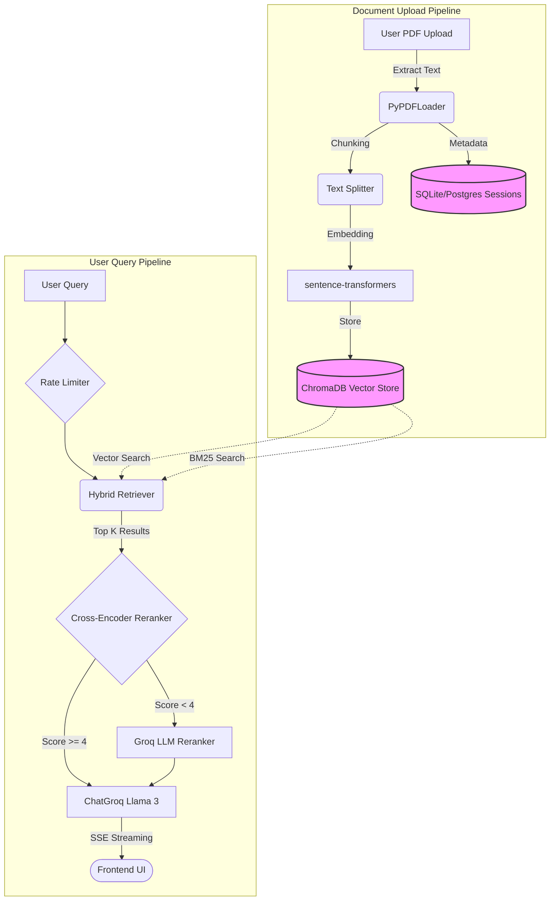

<div align="center">
  
  
  
  
  <br />
  
  <h1>🧠 DocMind AI</h1>
  
  <p><strong>A cloud-native Retrieval-Augmented Generation (RAG) application to chat intelligently with your PDFs.</strong></p>
  
  <p>
    <a href="https://docmind-frontend-817865882900.us-central1.run.app"><strong>Live Application</strong></a> · 
    <a href="#-getting-started"><strong>Getting Started</strong></a> · 
    <a href="#-architecture"><strong>Architecture</strong></a>
  </p>
</div>

---

> [!NOTE]
> **Live App:** [docmind-frontend-817865882900.us-central1.run.app](https://docmind-frontend-817865882900.us-central1.run.app)  
> **Backend API:** [docmind-backend-2jgx6au47a-uc.a.run.app](https://docmind-backend-2jgx6au47a-uc.a.run.app)

DocMind AI is a full-stack, cloud-native RAG application that allows users to interact with PDF documents using natural language. It is powered by **Groq Llama 3**, **LangChain**, and **ChromaDB**, fully deployed on **Google Cloud Run**.

---

## ✨ Features

- **⚡ Streaming Chat:** Real-time word-by-word streaming responses with page citations and confidence scores.
- **🔍 Advanced Hybrid Retrieval:** Merges and deduplicates results from both BM25 keyword search and dense vector similarity search.
- **🎯 Two-Stage Reranking:** Uses a local neural Cross-Encoder reranker by default, escalating to an LLM-based reranker (Groq) only when confidence is low.
- **🔒 Persistent Storage & Auth:** Secure Clerk authentication with isolated user sessions. Vector stores and chat history survive server scale-to-zero events via persistent volumes (SQLite/PostgreSQL).
- **🛡️ Enterprise Security:** Built-in per-IP sliding window rate limiting.
- **📊 Query Observability:** Comprehensive JSONL logging for all queries, capturing chunk distributions, reranker strategies, and confidence scores.
- **🎙️ Voice & Accessibility:** Full dictation support and Text-to-Speech (TTS) integration directly in the browser.
- **📝 Smart Output Modes:** Generate map-reduce summaries, structured study notes, and auto-suggested questions based on the document.

---

## 🏗 Architecture

The application is split into two distinct pipelines: **Document Ingestion** and **Query Processing**.

### High-Level System Flow



> [!TIP]
> **State Management:** The LangChain QA chain is kept in-memory for rapid execution. If the Cloud Run container scales to zero, the user is intelligently prompted to reload their document, while all metadata and chat history remains safely stored in the database.

---

## 🛠 Tech Stack

| Layer | Technology |
|---|---|
| **Frontend** | React 18, Vite, Framer Motion, react-pdf, Clerk Auth |
| **Backend** | FastAPI, Uvicorn, Python 3.11 |
| **LLM Inference** | Groq API (GPT-OSS 20B / GPT-OSS 120B / Gemma 2 9B) |
| **RAG Framework** | LangChain, LangChain-Groq, LangChain-Community |
| **Vector DB** | ChromaDB PersistentClient (Volume Mount) |
| **Embeddings** | sentence-transformers (`all-MiniLM-L6-v2`); lightweight fallback |
| **Retrieval** | BM25 (`rank-bm25`) + Vector Cosine Similarity |
| **Session Store** | SQLAlchemy (SQLite for Dev / PostgreSQL for Prod) |
| **Deployment** | Docker, Google Cloud Run |

---

## 🚀 Getting Started

### Prerequisites
- Python 3.11+ & Node.js 18+
- [Groq API Key](https://console.groq.com) (Free)
- [Clerk Account](https://clerk.com) (Free)

### 1. Clone the Repository
```bash
git clone https://github.com/mohamadammar21-0518/DocMind-AI.git
cd DocMind-AI
```

### 2. Start the Backend API
```bash
cd backend
python -m venv venv
venv\Scripts\activate        # Windows
# source venv/bin/activate   # Mac/Linux

pip install -r requirements.txt
```

Create a `backend/.env` file:
```env
GROQ_API_KEY=gsk_your_key_here
DATABASE_URL=sqlite:///./sessions.db
CHROMA_PERSIST_DIR=./chroma_db
ADMIN_API_KEY=local_dev_secret
```

Run the server:
```bash
uvicorn main:app --reload --port 8000
```

### 3. Start the Frontend
In a new terminal window:
```bash
cd frontend
npm install
```

Create a `frontend/.env.local` file:
```env
VITE_API_URL=http://localhost:8000
VITE_CLERK_PUBLISHABLE_KEY=pk_test_your_clerk_key_here
```

Run the development server:
```bash
npm run dev
```
Navigate to **http://localhost:5173** to view the application!

---

## ☁️ Deployment (Google Cloud Run)

### Backend Deployment
Deploy the FastAPI backend directly to Cloud Run:
```bash
cd backend
gcloud run deploy docmind-backend \
  --source . \
  --region us-central1 \
  --allow-unauthenticated \
  --set-env-vars GROQ_API_KEY=your_key,DATABASE_URL=postgresql://...
```
*(Ensure you mount a Cloud Run volume at `/data` and set `CHROMA_PERSIST_DIR=/data/chroma_db` for persistence).*

### Frontend Deployment
Build the React application with production variables and deploy:
```bash
cd frontend
npm run build

gcloud run deploy docmind-frontend \
  --source . \
  --region us-central1 \
  --allow-unauthenticated
```

---

## 🔌 Core API Reference

| Endpoint | Method | Description |
|---|---|---|
| `/upload` | `POST` | Upload and index PDFs into ChromaDB. |
| `/chat/stream` | `POST` | Streaming Q&A using Server-Sent Events (SSE). |
| `/summarize` | `POST` | Trigger Map-Reduce document summarization. |
| `/study-notes` | `POST` | Generate structured educational study notes. |
| `/session/{id}` | `GET` | Retrieve session state, chat history, and metadata. |
| `/admin/query-logs` | `GET` | *(Requires `X-Admin-Api-Key`)* Fetch recent observability logs. |

---

## ⚠️ Known Limitations
- **In-Memory QA Chain:** LangChain objects are not serializable. Users must re-upload documents if the backend container cold-starts.
- **Evaluation Requirements:** The `/evaluate` endpoint (using RAGAS) operates locally only and requires `pip install ragas datasets` to function.

## 📄 License
This project is licensed under the **MIT License**.

> Developed as a modern cloud-computing and AI portfolio project by **Mohamad Ammar**.
